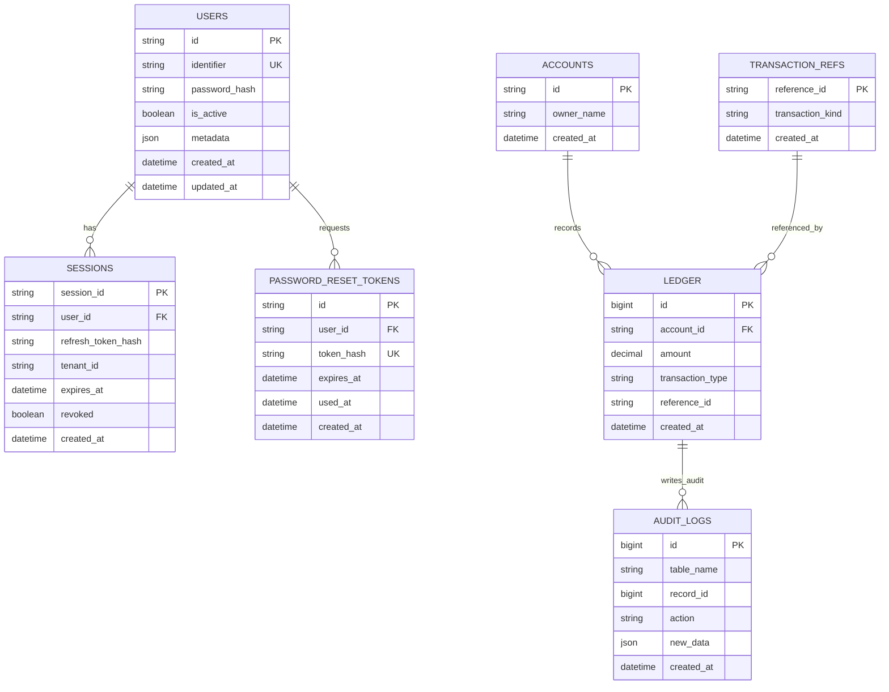

# Clean ER Diagram (Wallet + Auth)

Copy this directly into your report.

## Mermaid ER Diagram

## Relationship Summary

1. USERS (1) -> (N) SESSIONS
2. USERS (1) -> (N) PASSWORD_RESET_TOKENS
3. ACCOUNTS (1) -> (N) LEDGER
4. TRANSACTION_REFS (1) -> (N) LEDGER (via reference_id)
5. LEDGER (1) -> (N) AUDIT_LOGS (trigger-based audit writes)

## Figure Caption

Figure: ER diagram of the DBT Wallet system showing authentication entities (users, sessions, password reset tokens) and wallet entities (accounts, ledger, transaction references, audit logs), including idempotency reference mapping and trigger-based audit logging.
