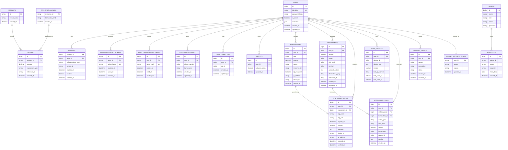

# Clean ER Diagram (Wallet + Auth)

Copy this directly into your report.

## Mermaid ER Diagram

```mermaid
erDiagram
    USERS {
        string id PK
        string identifier UK
        string password_hash
        boolean is_active
        json metadata
        datetime created_at
        datetime updated_at
    }

    SESSIONS {
        string session_id PK
        string user_id FK
        string refresh_token_hash
        string tenant_id
        datetime expires_at
        boolean revoked
        datetime created_at
    }

    PASSWORD_RESET_TOKENS {
        string id PK
        string user_id FK
        string token_hash UK
        datetime expires_at
        datetime used_at
        datetime created_at
    }

    EMAIL_VERIFICATION_TOKENS {
        string id PK
        string user_id FK
        string token_hash UK
        datetime expires_at
        datetime used_at
        datetime created_at
    }

    USER_LINKED_BANKS {
        string id PK
        string user_id FK
        string phone_number
        string bank_name
        datetime created_at
        datetime updated_at
    }

    USER_LINKED_UPIS {
        string id PK
        string user_id FK
        string upi_id
        datetime created_at
        datetime updated_at
    }

    ACCOUNTS {
        string id PK
        string owner_name
        datetime created_at
    }

    WALLETS {
        bigint id PK
        string user_id FK
        decimal balance_cached
        datetime updated_at
    }

    TRANSACTION_REFS {
        string reference_id PK
        string transaction_kind
        datetime created_at
    }

    LEDGER {
        bigint id PK
        string account_id FK
        decimal amount
        string transaction_type
        string reference_id
        datetime created_at
    }

    TRANSACTIONS {
        bigint id PK
        string user_id FK
        string type
        decimal amount
        string status
        string reference_id
        boolean otp_required
        string ip_address
        string device_id
        datetime created_at
    }

    WITHDRAWALS {
        bigint id PK
        string user_id FK
        decimal amount
        string status
        string risk_level
        string method
        json account_details
        string idempotency_key
        string reference_id
        datetime created_at
        datetime processed_at
    }

    OTP_VERIFICATIONS {
        bigint id PK
        string user_id FK
        bigint transaction_id FK
        string otp_code
        string otp_salt
        datetime expires_at
        boolean verified
        int attempts
        string device_id
        string ip_address
        datetime created_at
        datetime verified_at
    }

    USER_DEVICES {
        bigint id PK
        string user_id FK
        string device_id
        json device_info
        boolean trusted
        string last_ip_address
        datetime first_seen_at
        datetime last_used_at
    }

    WITHDRAWAL_LOGS {
        bigint id PK
        string user_id FK
        bigint withdrawal_id FK
        bigint transaction_id FK
        string event_type
        string risk_level
        decimal amount
        string ip_address
        string device_id
        json details
        datetime created_at
    }

    SUPPORT_TICKETS {
        bigint id PK
        string user_id FK
        string subject
        string description
        string status
        datetime created_at
        datetime resolved_at
    }

    WALLET_SECURITY_FLAGS {
        string user_id PK
        string status
        string reason
        datetime updated_at
    }

    ADMINS {
        bigint id PK
        string name
        string role
        string email
        string password
    }

    ADMIN_LOGS {
        bigint id PK
        string admin_id
        string action
        string target_id
        json meta_data
        datetime created_at
    }

    USERS ||--o{ SESSIONS : has
    USERS ||--o{ PASSWORD_RESET_TOKENS : requests
    USERS ||--o{ EMAIL_VERIFICATION_TOKENS : verifies
    USERS ||--o{ USER_LINKED_BANKS : links
    USERS ||--o{ USER_LINKED_UPIS : links
    USERS ||--o{ WALLETS : owns
    USERS ||--o{ TRANSACTIONS : creates
    USERS ||--o{ WITHDRAWALS : requests
    USERS ||--o{ OTP_VERIFICATIONS : receives
    USERS ||--o{ USER_DEVICES : uses
    USERS ||--o{ WITHDRAWAL_LOGS : generates
    USERS ||--o{ SUPPORT_TICKETS : opens
    USERS ||--|| WALLET_SECURITY_FLAGS : flagged_as
    ACCOUNTS ||--o{ LEDGER : records
    TRANSACTION_REFS ||--o{ LEDGER : referenced_by
    TRANSACTIONS ||--o{ OTP_VERIFICATIONS : guarded_by
    WITHDRAWALS ||--o{ WITHDRAWAL_LOGS : traced_by
    ADMINS ||--o{ ADMIN_LOGS : writes
```

## Relationship Summary

1. USERS (1) -> (N) SESSIONS
2. USERS (1) -> (N) PASSWORD_RESET_TOKENS
3. USERS (1) -> (N) EMAIL_VERIFICATION_TOKENS
4. USERS (1) -> (N) USER_LINKED_BANKS
5. USERS (1) -> (N) USER_LINKED_UPIS
6. USERS (1) -> (N) WALLETS
7. USERS (1) -> (N) TRANSACTIONS
8. USERS (1) -> (N) WITHDRAWALS
9. USERS (1) -> (N) OTP_VERIFICATIONS
10. USERS (1) -> (N) USER_DEVICES
11. USERS (1) -> (N) WITHDRAWAL_LOGS
12. USERS (1) -> (N) SUPPORT_TICKETS
13. USERS (1) -> (1) WALLET_SECURITY_FLAGS
14. ACCOUNTS (1) -> (N) LEDGER
15. TRANSACTION_REFS (1) -> (N) LEDGER
16. TRANSACTIONS (1) -> (N) OTP_VERIFICATIONS
17. WITHDRAWALS (1) -> (N) WITHDRAWAL_LOGS
18. ADMINS (1) -> (N) ADMIN_LOGS

## Figure Caption

Figure: ER diagram of the DBT Wallet system showing the authentication, wallet, security, support, and admin audit entities, including OTP verification, device tracking, withdrawal logging, and the ledger-backed balance model.
