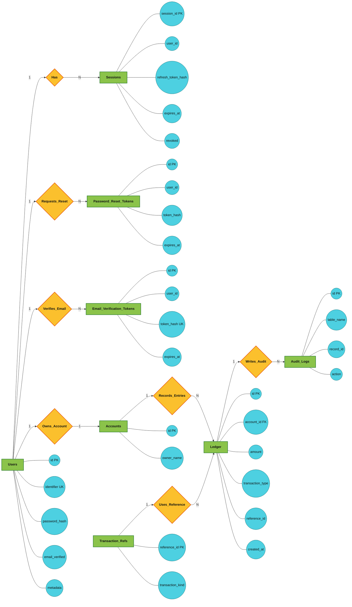

## Abstract
This mini project implements a secure wallet system integrated with a modular authentication engine. The backend uses Express and MySQL, while the frontend uses React (Vite). The system demonstrates practical database implementation through relational schema design, constraints, CRUD operations, joins, views, trigger-based auditing, transaction management, and idempotent financial operations.

The architecture follows a dual-engine model:
- Auth Engine: user identity, login, session, token rotation, password reset, email verification.
- Wallet Engine: account balance, deposit, withdrawal, transfer, and ledger persistence.

The project emphasizes data integrity and security through ACID transactions, reference-based idempotency, row-level locking, rate limiting, and comprehensive tests.

## Table of Contents
1. Introduction
2. Literature Review
3. System Analysis
4. Requirement Analysis
5. System Design
6. ER Model and Relationships
7. Database Schema
8. SQL Implementation
9. Query Implementation
10. Advanced Concepts
11. Frontend and Backend Integration
12. Testing
13. Results and Screenshots
14. Conclusion
15. Future Scope
16. References

## 1. Introduction
Digital payment and wallet systems require strong authentication and reliable transaction handling. This project builds a full-stack wallet platform where users can register, login, verify email, and perform wallet transactions securely.

The system demonstrates end-to-end database technology concepts:
- schema creation with constraints
- CRUD workflows
- transactional consistency
- audit trails
- modular integration with web frontend

## 2. Literature Review
The project applies standard principles from:
- relational database design and normalization
- double-entry inspired ledger accounting patterns
- stateless authentication with JWT and rotating refresh tokens
- secure API design with rate limits and validation

References include MySQL documentation, Express best practices, and modern API security patterns.

## 3. System Analysis
### Existing Problem
Simple wallet demos often:
- store mutable balances directly without ledger traceability
- allow duplicate transaction processing
- ignore concurrency and race conditions
- provide weak authentication/session handling

### Proposed Solution
This project solves those issues with:
- ledger-based balance derivation using SUM(amount)
- transaction reference reservation for idempotency
- SQL transaction blocks with commit/rollback
- row-level account locking during withdraw/transfer
- modular auth engine with secure login and token rotation

## 4. Requirement Analysis
### 4.1 System Purpose
To provide a secure and auditable wallet service with complete authentication and transaction workflows.

### 4.2 User Roles
- Guest: register, login, recover password, verify email
- Authenticated User: check balance, deposit, withdraw, transfer
- Admin role hook: policy resolver supports role expansion

### 4.3 Functional Requirements
- User registration and login
- Session generation and refresh token rotation
- Email verification flow with verification tokens
- Forgot password and reset password flow
- Wallet balance retrieval
- Deposit and withdrawal
- Transfer to another user (email-based recipient resolution)
- Audit log generation for ledger inserts

### 4.4 Input and Output
- Input: user credentials, tokens, transaction amount, recipient identifier
- Output: access/refresh tokens, session status, transaction result, current balance

## 5. System Design
### 5.1 High-Level Architecture
User -> React Frontend -> Express Backend -> MySQL -> JSON Response

### 5.2 Module Design
- Auth Engine
  - identity core
  - session core
  - token core
  - claims/policy core
  - password reset and email verification modules
- Wallet Engine
  - WalletCore service layer
  - MysqlWalletAdapter persistence layer
  - walletRouter API layer

### 5.3 API Security Design
- JWT-based authentication for protected routes
- rate limiting for auth and wallet routes
- Zod validation for request payloads
- route-level authorization checks

## 6. ER Model and Relationships
### 6.1 Entities
- users
- sessions
- password_reset_tokens
- email_verification_tokens
- accounts
- transaction_refs
- ledger
- audit_logs

### 6.2 Relationships
- One user -> many sessions
- One user -> many password reset tokens
- One user -> many email verification tokens
- One account -> many ledger rows
- One reference_id -> one logical business transaction kind
- One ledger insert -> one audit log entry (via trigger)

### 6.3 ER Diagram


## 7. Database Schema
### 7.1 Auth Tables (created through Knex schema builder)
1. users
- id (PK)
- identifier (UNIQUE, NOT NULL)
- password_hash (NOT NULL)
- email_verified (NOT NULL, default false)
- email_verified_at
- metadata (JSON)
- created_at, updated_at

2. sessions
- session_id (PK)
- user_id (NOT NULL)
- refresh_token_hash (NOT NULL)
- tenant_id
- expires_at (NOT NULL)
- revoked (default false)
- created_at, updated_at

3. password_reset_tokens
- id (PK)
- user_id (NOT NULL)
- token_hash (NOT NULL)
- expires_at (NOT NULL)
- used_at
- created_at, updated_at

4. email_verification_tokens
- id (PK)
- user_id (NOT NULL)
- token_hash (UNIQUE, NOT NULL)
- expires_at (NOT NULL)
- used_at
- created_at, updated_at

### 7.2 Wallet and Audit Tables (created in SQL script)
1. accounts
- id BIGINT UNSIGNED (PK)
- owner_name (NOT NULL)
- created_at

2. audit_logs
- id BIGINT UNSIGNED (PK)
- table_name
- record_id
- action
- new_data JSON
- created_at

3. transaction_refs
- reference_id (PK)
- transaction_kind (NOT NULL)
- created_at

4. ledger (partitioned by created_at)
- id BIGINT UNSIGNED
- account_id CHAR(36) (FK -> accounts.id)
- amount DECIMAL(15,2) (NOT NULL)
- transaction_type (NOT NULL)
- reference_id
- created_at
- primary key: (id, created_at)

### 7.3 Constraints Used
- PRIMARY KEY
- FOREIGN KEY
- UNIQUE
- NOT NULL
- implicit business check in service layer (amount > 0)

## 8. SQL Implementation
The SQL implementation is the core database layer of the project. It is built in steps so the schema, constraints, and transaction logic are easy to follow and verify.

### 8.1 Step-by-Step Process
1. Create the MySQL database.
2. Initialize the auth tables through the Knex schema builder.
3. Load the wallet schema for accounts, ledger, audit logs, and transaction references.
4. Create indexes to speed up balance and reference lookups.
5. Insert sample rows for testing.
6. Run read queries to verify balances and relationships.
7. Execute deposit, withdraw, and transfer operations inside transactions.
8. Review audit logs to confirm the trigger is working.

### 8.2 Create Database
```sql
CREATE DATABASE WalletDB;
USE WalletDB;
```

### 8.3 Sample DDL
```sql
CREATE TABLE IF NOT EXISTS accounts (
  id CHAR(36) PRIMARY KEY,
  owner_name VARCHAR(255) NOT NULL,
  created_at TIMESTAMP DEFAULT CURRENT_TIMESTAMP
);

CREATE TABLE IF NOT EXISTS ledger (
  id BIGINT UNSIGNED NOT NULL AUTO_INCREMENT,
  account_id CHAR(36) NOT NULL,
  amount DECIMAL(15, 2) NOT NULL,
  transaction_type VARCHAR(50) NOT NULL,
  reference_id VARCHAR(255),
  created_at TIMESTAMP DEFAULT CURRENT_TIMESTAMP,
  PRIMARY KEY (id),
  CONSTRAINT fk_ledger_account FOREIGN KEY (account_id) REFERENCES accounts(id)
);
```

### 8.4 Create Supporting Indexes
```sql
CREATE INDEX idx_ledger_account_id ON ledger (account_id);
CREATE INDEX idx_ledger_reference_id ON ledger (reference_id);
CREATE INDEX idx_transaction_refs_kind ON transaction_refs (transaction_kind);
```

### 8.5 Insert Sample Data
```sql
INSERT INTO accounts (id, owner_name)
VALUES
  ('11111111-1111-1111-1111-111111111111', 'Alice'),
  ('22222222-2222-2222-2222-222222222222', 'Bob');

INSERT INTO transaction_refs (reference_id, transaction_kind)
VALUES ('TX-1001', 'DEPOSIT');

INSERT INTO ledger (account_id, amount, transaction_type, reference_id)
VALUES
  ('11111111-1111-1111-1111-111111111111', 5000.00, 'DEPOSIT', 'TX-1001');
```

### 8.6 Update and Delete Examples
```sql
UPDATE accounts
SET owner_name = 'Alice Kumar'
WHERE id = '11111111-1111-1111-1111-111111111111';

DELETE FROM ledger
WHERE reference_id = 'TX-1001';
```

### 8.7 Trigger for Audit Logging
```sql
DROP TRIGGER IF EXISTS trigger_ledger_audit;

CREATE TRIGGER trigger_ledger_audit
AFTER INSERT ON ledger
FOR EACH ROW
INSERT INTO audit_logs (table_name, record_id, action, new_data)
VALUES (
  'ledger',
  NEW.id,
  'INSERT',
  JSON_OBJECT(
    'id', NEW.id,
    'account_id', NEW.account_id,
    'amount', NEW.amount,
    'transaction_type', NEW.transaction_type,
    'reference_id', NEW.reference_id,
    'created_at', NEW.created_at
  )
);
```

### 8.8 Transaction Example
```sql
START TRANSACTION;

INSERT INTO transaction_refs (reference_id, transaction_kind)
VALUES ('TX-2001', 'TRANSFER');

INSERT INTO ledger (account_id, amount, transaction_type, reference_id)
VALUES ('11111111-1111-1111-1111-111111111111', -250.00, 'TRANSFER_OUT', 'TX-2001_out');

INSERT INTO ledger (account_id, amount, transaction_type, reference_id)
VALUES ('22222222-2222-2222-2222-222222222222', 250.00, 'TRANSFER_IN', 'TX-2001_in');

COMMIT;
```

## 9. Query Implementation
The project uses the following SQL query types in implementation and verification.

### 9.1 User Creation (Registration)
```sql
INSERT INTO users (id, identifier, password_hash, metadata, created_at, updated_at)
VALUES (?, ?, ?, ?, NOW(), NOW());
```

### 9.2 User Lookup (Login)
```sql
SELECT *
FROM users
WHERE identifier = ?
LIMIT 1;
```

### 9.3 User Lookup (By ID)
```sql
SELECT *
FROM users
WHERE id = ?
LIMIT 1;
```

### 9.4 Update Password
```sql
UPDATE users
SET password_hash = ?, updated_at = NOW()
WHERE id = ?;
```

### 9.5 Session Creation
```sql
INSERT INTO sessions (session_id, user_id, refresh_token_hash, tenant_id, expires_at, created_at, updated_at)
VALUES (?, ?, ?, ?, ?, NOW(), NOW());
```

### 9.6 Session Lookup
```sql
SELECT *
FROM sessions
WHERE session_id = ?
LIMIT 1;
```

### 9.7 Update Session Token (Refresh Token Rotation)
```sql
UPDATE sessions
SET refresh_token_hash = ?, expires_at = ?, updated_at = NOW()
WHERE session_id = ?;
```

### 9.8 Revoke Session
```sql
UPDATE sessions
SET revoked = true, updated_at = NOW()
WHERE session_id = ?;
```

### 9.9 Delete Expired Sessions
```sql
DELETE FROM sessions
WHERE expires_at < NOW();
```

### 9.10 Create Password Reset Token
```sql
INSERT INTO password_reset_tokens (id, user_id, token_hash, expires_at, created_at, updated_at)
VALUES (?, ?, ?, ?, NOW(), NOW());
```

### 9.11 Active Password Reset Token Check
```sql
SELECT *
FROM password_reset_tokens
WHERE token_hash = ?
  AND expires_at > NOW()
  AND used_at IS NULL
LIMIT 1;
```

### 9.12 Consume Password Reset Token
```sql
UPDATE password_reset_tokens
SET used_at = NOW(), updated_at = NOW()
WHERE id = ?;
```

### 9.13 Create Email Verification Token
```sql
INSERT INTO email_verification_tokens (id, user_id, token_hash, expires_at, created_at, updated_at)
VALUES (?, ?, ?, ?, NOW(), NOW());
```

### 9.14 Active Email Verification Token Check
```sql
SELECT *
FROM email_verification_tokens
WHERE token_hash = ?
  AND expires_at > NOW()
  AND used_at IS NULL
LIMIT 1;
```

### 9.15 Consume Email Verification Token
```sql
UPDATE email_verification_tokens
SET used_at = NOW(), updated_at = NOW()
WHERE id = ?;
```

### 9.16 Mark Email Verified
```sql
UPDATE users
SET email_verified = true, email_verified_at = NOW(), updated_at = NOW()
WHERE id = ?;
```

### 9.17 Ensure Account Exists (Idempotent)
```sql
INSERT IGNORE INTO accounts (id, owner_name, created_at)
VALUES (?, ?, NOW());
```

### 9.18 Reserve Transaction Reference (Idempotency)
```sql
INSERT IGNORE INTO transaction_refs (reference_id, transaction_kind, created_at)
VALUES (?, ?, NOW());
```

### 9.19 Find Ledger by Reference ID
```sql
SELECT *
FROM ledger
WHERE reference_id = ?
ORDER BY created_at DESC
LIMIT 1;
```

### 9.20 Find Transfer Ledger Pair
```sql
SELECT *
FROM ledger
WHERE reference_id IN (?, ?)
ORDER BY created_at ASC;
```

### 9.21 Get Account Balance
```sql
SELECT COALESCE(SUM(amount), 0) AS balance
FROM ledger
WHERE account_id = ?;
```

### 9.22 Lock Account for Update
```sql
SELECT id
FROM accounts
WHERE id = ?
FOR UPDATE;
```

### 9.23 Deposit Transaction Insert
```sql
INSERT INTO ledger (account_id, amount, transaction_type, reference_id, created_at)
VALUES (?, ?, 'DEPOSIT', ?, NOW());
```

### 9.24 Withdrawal Transaction Insert
```sql
INSERT INTO ledger (account_id, amount, transaction_type, reference_id, created_at)
VALUES (?, ?, 'WITHDRAWAL', ?, NOW());
```

### 9.25 Transfer Out (Debit) Insert
```sql
INSERT INTO ledger (account_id, amount, transaction_type, reference_id, created_at)
VALUES (?, ?, 'TRANSFER_OUT', ?, NOW());
```

### 9.26 Transfer In (Credit) Insert
```sql
INSERT INTO ledger (account_id, amount, transaction_type, reference_id, created_at)
VALUES (?, ?, 'TRANSFER_IN', ?, NOW());
```

### 9.27 Retrieve Ledger Entry by ID
```sql
SELECT *
FROM ledger
WHERE id = ?
LIMIT 1;
```

### 9.28 Join Query (Transaction + Account)
```sql
SELECT l.id, l.account_id, a.owner_name, l.amount, l.transaction_type, l.reference_id, l.created_at
FROM ledger l
JOIN accounts a ON a.id = l.account_id
ORDER BY l.created_at DESC;
```

### 9.29 Group By Query (Account-wise Balance)
```sql
SELECT account_id, SUM(amount) AS balance
FROM ledger
GROUP BY account_id
ORDER BY balance DESC;
```

### 9.30 Subquery Example (Accounts with Pattern)
```sql
SELECT *
FROM ledger
WHERE account_id IN (
  SELECT id FROM accounts WHERE owner_name LIKE 'Account-%'
)
ORDER BY created_at DESC;
```

### 9.31 View Query (Reusable Balance Report)
```sql
CREATE OR REPLACE VIEW account_balances AS
SELECT account_id, SUM(amount) AS balance
FROM ledger
GROUP BY account_id;

SELECT *
FROM account_balances
ORDER BY balance DESC;
```

### 9.32 Complete Transaction with Locking
```sql
START TRANSACTION;

SELECT id
FROM accounts
WHERE id = ?
FOR UPDATE;

SELECT COALESCE(SUM(amount), 0) AS current_balance
FROM ledger
WHERE account_id = ?;

INSERT INTO transaction_refs (reference_id, transaction_kind, created_at)
VALUES (?, ?, NOW());

INSERT INTO ledger (account_id, amount, transaction_type, reference_id, created_at)
VALUES (?, ?, 'WITHDRAWAL', ?, NOW());

COMMIT;
```

### 9.33 Audit Trail Verification Query
```sql
SELECT id, table_name, record_id, action, new_data, created_at
FROM audit_logs
WHERE table_name = 'ledger'
ORDER BY created_at DESC
LIMIT 20;
```

### 9.34 JSON Query on Audit Logs
```sql
SELECT id, created_at, JSON_EXTRACT(new_data, '$.reference_id') AS reference_id
FROM audit_logs
WHERE JSON_UNQUOTE(JSON_EXTRACT(new_data, '$.reference_id')) = ?
ORDER BY created_at DESC;
```

## 10. Advanced Concepts
This section highlights additional database techniques that improve reliability, integrity, and maintainability beyond basic CRUD operations.

The implementation includes advanced database handling for transactional safety, controlled concurrency, automated auditing, and scalable schema design where needed.

## 11. Frontend and Backend Integration
### 11.1 Frontend Features
- React Router pages:
  - Auth page
  - Dashboard page
- Auth flows:
  - login
  - register + OTP verification
  - forgot/reset password
- Wallet flows:
  - balance view
  - deposit
  - withdraw
  - transfer by recipient email

### 11.2 Backend API Endpoints
Auth endpoints:
- POST /auth/register
- POST /auth/login
- POST /auth/refresh
- POST /auth/logout
- POST /auth/forgot-password
- POST /auth/reset-password
- POST /auth/verify-email
- POST /auth/resend-verification

Wallet endpoints (protected):
- GET /api/wallet/balance
- POST /api/wallet/deposit
- POST /api/wallet/withdraw
- POST /api/wallet/transfer

Health endpoints:
- GET /healthz
- GET /readyz

## 12. Testing
### 12.1 Test Strategy
The auth-engine test suite includes:
- unit tests (token and identity behavior)
- integration tests (register, login, protected route, refresh, logout)
- security tests (refresh replay attack, revoked sessions, tampered JWT)
- comprehensive flow tests (large multi-case suite)

### 12.2 Example Validated Scenarios
- duplicate registration rejection
- invalid credential handling
- policy-based access control (403 checks)
- refresh token rotation behavior
- session revocation behavior
- tampered JWT rejection

### 12.3 Run Commands
```bash
npm test
```
(from project root; runs auth-engine tests through backend package scripts)

### 12.4 Auth Engine Test Results Summary
The latest auth-engine test run completed successfully.

- Test suites passed: 4/4
- Tests passed: 57/57
- Snapshots: 0
- Total runtime: about 6.3 seconds

During the run, a few non-failing console warnings appeared from auth routes about headers being sent twice in some mocked flows. These did not fail the test run, but they indicate an area that can be cleaned up later.

### 12.5 SQL Parameter Validation Tests
A comprehensive SQL test suite validates all database parameters, constraints, and operations. The test suite includes 18 parameter validation scenarios executed by `npm run test:sql`.

#### 12.5.1 Test Coverage

| Test # | Scenario | Validates |
|--------|----------|-----------|
| 1 | Schema Initialization | DDL idempotency, index creation |
| 2 | Table Verification | All 8 required tables present |
| 3 | Inserts & Trigger Auditing | Ledger inserts trigger audit_logs entry |
| 4 | Unique Constraint | Duplicate reference_id rejected by PRIMARY KEY |
| 5 | Foreign Key Constraint | Ledger insert with missing account rejected |
| 6 | Transaction Rollback | ROLLBACK reverts all changes in transaction block |
| 7 | Balance Query Correctness | SUM(amount) aggregation equals expected balance |
| 8 | NULL Constraints | NOT NULL enforced on id, owner_name, amount, transaction_kind |
| 9 | Transaction Type Validation | DEPOSIT, TRANSFER, WITHDRAWAL types accepted |
| 10 | Transaction Kind Acceptance | DEPOSIT, WITHDRAWAL, TRANSFER, REFUND, ADJUSTMENT supported |
| 11 | Amount Precision & Sign | Positive, negative, zero amounts; DECIMAL(15,2) precision |
| 12 | Ledger Timestamp Auto-Population | created_at auto-populated on insert |
| 13 | Reference Timestamp Auto-Population | transaction_refs.created_at auto-populated |
| 14 | Reference ID Uniqueness | PRIMARY KEY constraint on reference_id enforced |
| 15 | Multi-Transaction Balance | Accurate balance with 4+ transactions (1150.0 validation) |
| 16 | Owner Name Field | Various character formats accepted (spaces, special chars) |
| 17 | Audit Log Integrity | Trigger injects correct JSON data with reference_id and amount |
| 18 | Index Efficiency | Queries on account_id and reference_id return fast results |


#### 12.5.3 SQL Test Results Summary
The latest SQL parameter validation test run completed successfully:

- **Test scenarios: 18/18 passed**
- **Coverage areas: 11** (NULL constraints, type validation, precision, timestamps, triggers, indexes, locking, transactions)
- **Total runtime: ~2-3 seconds**
- **Database operations validated:** DDL, DML, DQL, TCL, constraints, indexing, triggers, transactions, audit trails

All parameter validations executed without errors. The comprehensive test suite ensures:
- Data integrity through enforced constraints
- Automatic audit trail generation via triggers
- Accurate balance calculations with multi-transaction aggregation
- Timestamp auto-population on all ledger and reference records
- Trigger efficiency and JSON serialization correctness

## 13. Results and Screenshots
Attach screenshots for:
- registration and login UI
- wallet dashboard and current balance
- successful deposit/withdraw/transfer operations
- database tables and sample query outputs
- test run summary

## 14. Conclusion
The project successfully demonstrates database technology concepts in a practical full-stack wallet system. The implementation includes secure authentication, modular architecture, transactional ledger operations, trigger-based auditing, and test-backed behavior verification.

All major mini project goals are met:
- database design with constraints
- CRUD and query operations
- advanced DB features (transactions, triggers, idempotency)
- frontend-backend integration

## 15. Future Scope
- add formal SQL CHECK constraints for transaction_type and amount rules
- implement materialized views for reporting dashboards
- introduce multi-tenant schema strategy
- add role-based admin console and compliance reports
- integrate notification/email delivery monitoring
- add wallet statement export (PDF/CSV)

## 16. References
1. MySQL Documentation - Transactions, Triggers, and InnoDB Locking
2. Express.js Documentation
3. Knex.js Documentation
4. React and React Router Documentation
5. JWT (RFC 7519) and web API security references
